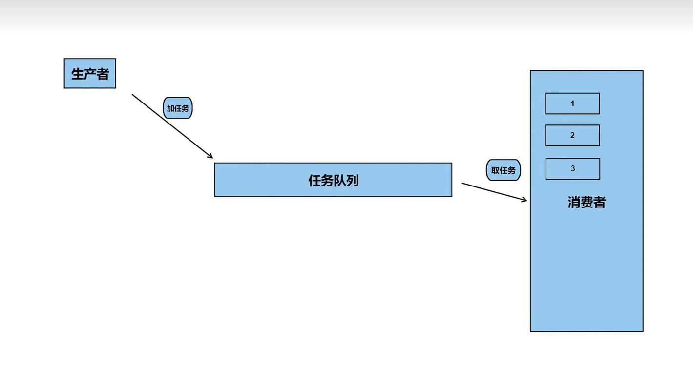

生产者与消费者模型


核心成员：
- 生产者（厨师）：负责不断生成数据（做菜），并将其放在一个共享的容器中。  
- 消费者（服务员）：负责从共享容器中取出数据（端菜），并将其消耗/处理掉。  
- 共享缓冲区（出餐台）：连接生产者和消费者的“桥梁”，通常是一个队列（Queue）。

在共同访问同一个缓冲区，因此必须有严格的规则：
互斥：同一时间只能有一个线程访问缓冲区，避免数据冲突和不一致。
同步：生产者和消费者需要协调工作，确保生产者不会在缓冲区满时继续生产，消费者也不会在缓冲区空时继续消费。

```cpp
#include <condition_variable>
#include <mutex>
#include <queue>
using namespace std;

mutex mtx;
queue<int> q;
condition_variable cv;
// 生产者线程函数
void producer(){
    for(int i=0;i<10,i++){
        {//使锁在作用域结束时自动释放
        unique_lock<mutex> lock(mtx);
        q.push(i); // 生产数据，然后通知消费者取任务
        cv.notify_one(); // 通知消费者线程
        cout<<"生产者："<<i<<endl;
        }
        //cv.notify_one();//可以把通知放到解锁之后
        this_thread::sleep_for(chrono::milliseconds(100)); // 模拟生产时间
    }
}

// 消费者线程函数
void comsumer(){
    while(1){
        unique_lock<mutex> lock(mtx);

        //如果队列为空，等待生产者生产数据
        cv.wait(lock,[](){//false等待
            return !q.empty(); 
        });

        int value = g.front(); // 消费数据
        g.pop();
    }
}

int main(){
    thread t1(producer);
    thread t2(consumer);
    t1.join();
    t2.join();
    return 0;
}
```
当你在锁里面调用 notify_one() 时发生了什么：  
生产者拿到锁 mtx，把数据 push 进队列。  
生产者调用 cv.notify_one()。  
消费者听到通知，从 cv.wait() 中醒来。  
⚠️ 注意： 消费者醒来的第一件事是试图重新获取锁 mtx。  
冲突发生： 这时候生产者的代码还没走到 }，锁还在生产者手里！所以消费者刚一醒来，发现锁不到，马上又被迫进入阻塞睡眠状态（这次是等锁，不是等条件变量）。  
生产者终于走到 }，释放了锁。  
消费者这才真正拿到锁，继续往下执行。  


```


