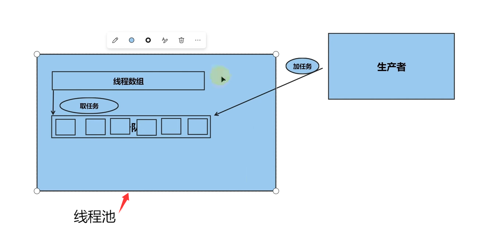

# 线程池

```cpp
#include <thread>
#include <queue>
#include <thread>
#include <mutex>
#include <condition_variable>
#include <vector>
#include <functional>
using namespace std;
//线程池类
class ThreadPool{
public:
    ThreadPool(int numThreads):isstop(false){
        for(int i=0;i<numThreads;i++){//创建指定数量的线程
        //因为你的容器类型是 vector<std::thread>，当执行 emplace_back(参数) 时，这个“参数”会被直接转移并喂给 std::thread 的构造函数。
            threads.emplace_back([this](){
                while(1){
                    unique_lock<mutex> lock(mtx);
                    cv.wait(lock,[this](){
                        return !tasks.empty() || isstop;//当有任务或线程池停止时，唤醒线程
                    });
                    if(isstop==true && tasks.empty()==true){//线程池停止且无任务，退出线程
                        return;
                    }
                    function<void()> task(move(tasks.front())); //获取任务
                    tasks.pop(); //移除任务
                    lock.unlock();
                    task();//执行任务
                }
            });

        }
    }
    ~ThreadPool(){
        {
            unique_lock<mutex> lock(mtx);
            isstop=true;//设置停止标志
        }
        cv.notify_all();
        for(auto &it : threads){
            it.join(); 
        }
    }
    //函数模板，打包函数并放进队列
    template<typename F,typename... Args>
    void enqueue(F&& f, Args&&... args){
        function<void()> task=bind(forward<F>(f),forward<Args>(args)...); //绑定函数和参数
        {
            unique_lock<mutex> lock(mtx);
            tasks.emplace(move(task)); //添加任务到队列
        }
        cv.notify_one();

    }
private:
    //先建一个线程数组
    vector<thread> threads; 
    //任务(函数)队列
    queue<function<void()>> tasks;
    //互斥量和条件变量
    mutex mtx;
    condition_variable cv;
    //标志线程池是否停止
    bool isstop;
};
int main(){
    ThreadPool pool(4); //创建一个包含4个线程的线程池
    for(int i=0;i<10;i++){
        pool.enqueue([i](){ //向线程池提交任务
            cout<<"Task "<<i<<" is running in thread "<<this_thread::get_id()<<endl;
        });
    }
    return 0;
}
```

# 知识点
- #include<functional\>
```cpp
#include<functional>
function是一个模板类，可以存储任何可调用对象（函数、lambda表达式、函数对象等）  
语法：
std::function<返回类型(参数类型1, 参数类型2, ...)> 变量名;
```

- 可变参数模板
在普通函数模板中，...表示这里可以接收任意数量、任意类型的模板参数
```cpp
template<typename F, typename... Args>
template<class F, class... Args> 
```
- move移动语义
传统的 C++ 在对象的赋值或传递时，默认使用拷贝语义,非常耗时且消耗资源  
移动语义允许我们将一个对象的资源,直接转移给另一个对象，只需改变指针的指向  
std::move将一个左值强制类型转换为右值引用  

- 左值与右值简单区分
左值 (Lvalue)：有确定的内存地址、有名字的变量（例如：int a = 10; 中的 a）  
右值 (Rvalue)：通常是临时的、没有名字的、马上要被销毁的值（例如：字面量 10，或者函数返回的临时对象）。

- &&右值引用
一般的引用&只能绑定左值
&&右值引用只能绑定右值
```cpp
void enqueue(F&& f, Args&&... args)
F&& f:万能引用,可以接收左值，也可以接收右值
Args&&... args:参数包,万能引用
```

- 完美转发，左转右，右转左

- bind函数适配器
队列要求所有的任务必须是 “不带参数” 且 “无返回值（void）” 的格式  
bind提前把函数和它的参数绑定死，变成一个不需要传参的闭包对象  
符合 function<void()>

- chrono时间库
```cpp
#include <chrono>
// 线程休眠 500 毫秒
std::this_thread::sleep_for(std::chrono::milliseconds(500));

// 线程休眠 2 秒
std::this_thread::sleep_for(std::chrono::seconds(2));
```